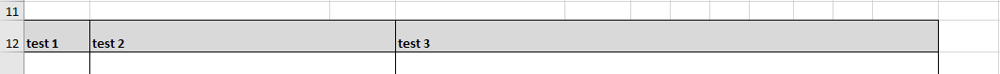

## excel export시 한 cell에 여러 스타일 적용

 [DataTable 홈페이지](https://datatables.net/reference/button/excelHtml5#Customisation)에서 제공하는 **built in styles** 값으로만 적용을 해주면 다중 적용은 되지 않았다.

`background-color, border, text-center, wrapped text(line break)` 등 여러 style을 하나의 cell에 적용하고 싶었다. <br>

### 기존
아래 코드처럼 같은 cell에 다른 attribute 값을 주면 마지막꺼가 적용이 된다.

`excel example`



```js
$('c[r=A12]', sheet).attr('s', '51'); //  Centred text
$('c[r=A12]', sheet).attr('s', '32'); // Bold, grey background, thin black border
```
### 변경

`excel example`

아래 엑셀은 위와 다르게 깔끔하게 정렬이 된 것을 볼 수 있다. <br>
또한 기본으로 제공되는 4가지 color 외 다른 color를 자유자재로 쓸 수 있다 🙊 


```js
customize: function (xlsx) {
    let sSh = xlsx.xl['styles.xml'];
    let lastXfIndex = $('cellXfs xf', sSh).length - 1;
    let sheet = xlsx.xl.worksheets['sheet1.xml'];

    // red
    let f1 = '<fill><patternFill patternType="solid"><fgColor rgb="FFFF0000" /><bgColor indexed="64" /></patternFill></fill>';
    //orange
    let f2 = '<fill><patternFill patternType="solid"><fgColor rgb="FFFFA500" /><bgColor indexed="64" /></patternFill></fill>';
    // green
    let f3 = '<fill><patternFill patternType="solid"><fgColor rgb="FF008000" /><bgColor indexed="64" /></patternFill></fill>';
    // grey
    let f4 = '<fill><patternFill patternType="solid"><fgColor rgb="F2F2F2" /><bgColor indexed="64" /></patternFill></fill>';
    // white
    let f5 = '<fill><patternFill patternType="solid"><fgColor rgb="#ffffff" /><bgColor indexed="64" /></patternFill></fill>';

    let s1 = '<xf numFmtId="0" fontId="1" fillId="0" borderId="1" applyFont="1" applyFill="1" applyBorder="1" xfId="0" applyAlignment="1"><alignment vertical="top" horizontal="left" wrapText="1" /></xf>';
    let s2 = '<xf numFmtId="0" fontId="0" fillId="6" borderId="1" applyFont="1" applyFill="1" applyBorder="1" xfId="0" applyAlignment="1"><alignment vertical="top" horizontal="left" wrapText="1" /></xf>';
    let s3 = '<xf numFmtId="0" fontId="0" fillId="0" borderId="1" applyFont="1" applyFill="1" applyBorder="1" xfId="0" applyAlignment="1"><alignment horizontal="left" vertical="top" wrapText="1" /></xf>';
    let s4 = '<xf numFmtId="0" fontId="0" fillId="7" borderId="1" applyFont="1" applyFill="1" applyBorder="1" xfId="0" applyAlignment="1"><alignment vertical="center" horizontal="center" wrapText="1" /></xf>';
    let s5 = '<xf numFmtId="0" fontId="0" fillId="8" borderId="1" applyFont="1" applyFill="1" applyBorder="1" xfId="0" applyAlignment="1"><alignment vertical="top" horizontal="left" wrapText="1" /></xf>';
    let s6 = '<xf numFmtId="0" fontId="0" fillId="9" borderId="1" applyFont="1" applyFill="1" applyBorder="1" xfId="0" applyAlignment="1"><alignment vertical="center" horizontal="center" wrapText="1" /></xf>';

    sSh.childNodes[0].childNodes[2].innerHTML += f1 + f2 + f3 + f4 + f5;
    sSh.childNodes[0].childNodes[5].innerHTML += s1 + s2 + s3 + s4 + s5 + s6;

    let normal = lastXfIndex + 1;
    let red = lastXfIndex + 2;
    let white = lastXfIndex + 3;
    let orange = lastXfIndex + 4;
    let green = lastXfIndex + 5;
    let lightGrey = lastXfIndex + 6;

    let mergeCells = $('mergeCells', sheet);
    let col = $('col', sheet);
    let init_data = ['A', 'B', 'C', 'D', 'E', 'F', 'G', 'H', 'I', 'J', 'K', 'L'];
    let periodSumRowForColor = sendList.length + 5;
    let workIssueColspan = sendList.length + 9;
    let contentMappingColspan = sendList_nextday.length;

    //background-color
    $('row c[r^=' + 'A14' + ']', sheet).each(function () {
        $(this).attr('s', lightGrey);
    })
    $('row c[r^=' + 'B14' + workIssueColspan + ']', sheet).each(function () {
        $(this).attr('s', lightGrey);
    })
    $('row c[r^=' + 'C14' + workIssueColspan + ']', sheet).each(function () {
        $(this).attr('s', lightGrey);
    })
    $('row c[r^=' + 'D14' + workIssueColspan + ']', sheet).each(function () {
        $(this).attr('s', lightGrey);
    })
}
```

### 참고
- https://www.datatables.net/forums/discussion/comment/135501