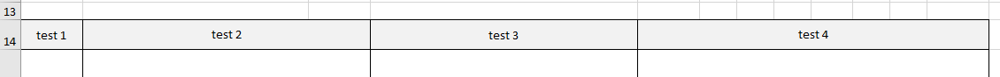

## excel export시 한 cell에 여러 스타일 적용

 [DataTable 홈페이지](https://datatables.net/reference/button/excelHtml5#Customisation)에서 제공하는 **built in styles** 값으로만 적용을 해주면 다중 적용은 되지 않았다.

`background-color, border, text-center, wrapped text(line break)` 등 여러 style을 하나의 cell에 적용하고 싶었다. <br>

### 기존
아래 코드처럼 같은 cell에 다른 attribute 값을 주면 마지막꺼가 적용이 된다.

`excel example`


```js
$('c[r=A12]', sheet).attr('s', '51'); //  Centred text
$('c[r=A12]', sheet).attr('s', '32'); // Bold, grey background, thin black border
```
### 변경 ( Chrome, FF )
IE 브라우저는 아래 코드의 문법을 사용할 수 없다. 따라서 브라우저 별 코드를 따로 정리했다.

`excel example`

아래 엑셀은 위와 다르게 깔끔하게 정렬이 된 것을 볼 수 있다. <br>
또한 기본으로 제공되는 4가지 color 외 다른 color를 자유자재로 쓸 수 있다 🙊 



```js
// text bold 설정 
'<xf fontId="2"/></xf>'

// number에 comma 표출 (3자리씩)
'<xf numFmtId="3"/></xf>'

```

```js
customize: function (xlsx) {
    let sSh = xlsx.xl['styles.xml'];
    let lastXfIndex = $('cellXfs xf', sSh).length - 1;
    let sheet = xlsx.xl.worksheets['sheet1.xml'];

    // red
    let f1 = '<fill><patternFill patternType="solid"><fgColor rgb="FFFF0000" /><bgColor indexed="64" /></patternFill></fill>';
    //orange
    let f2 = '<fill><patternFill patternType="solid"><fgColor rgb="FFFFA500" /><bgColor indexed="64" /></patternFill></fill>';
    // green
    let f3 = '<fill><patternFill patternType="solid"><fgColor rgb="FF008000" /><bgColor indexed="64" /></patternFill></fill>';
    // grey
    let f4 = '<fill><patternFill patternType="solid"><fgColor rgb="F2F2F2" /><bgColor indexed="64" /></patternFill></fill>';
    // white
    let f5 = '<fill><patternFill patternType="solid"><fgColor rgb="#ffffff" /><bgColor indexed="64" /></patternFill></fill>';

    let s1 = '<xf numFmtId="0" fontId="1" fillId="0" borderId="1" applyFont="1" applyFill="1" applyBorder="1" xfId="0" applyAlignment="1"><alignment vertical="top" horizontal="left" wrapText="1" /></xf>';
    let s2 = '<xf numFmtId="0" fontId="0" fillId="6" borderId="1" applyFont="1" applyFill="1" applyBorder="1" xfId="0" applyAlignment="1"><alignment vertical="top" horizontal="left" wrapText="1" /></xf>';
    let s3 = '<xf numFmtId="0" fontId="0" fillId="0" borderId="1" applyFont="1" applyFill="1" applyBorder="1" xfId="0" applyAlignment="1"><alignment horizontal="left" vertical="top" wrapText="1" /></xf>';
    let s4 = '<xf numFmtId="0" fontId="0" fillId="7" borderId="1" applyFont="1" applyFill="1" applyBorder="1" xfId="0" applyAlignment="1"><alignment vertical="center" horizontal="center" wrapText="1" /></xf>';
    let s5 = '<xf numFmtId="0" fontId="0" fillId="8" borderId="1" applyFont="1" applyFill="1" applyBorder="1" xfId="0" applyAlignment="1"><alignment vertical="top" horizontal="left" wrapText="1" /></xf>';
    let s6 = '<xf numFmtId="0" fontId="0" fillId="9" borderId="1" applyFont="1" applyFill="1" applyBorder="1" xfId="0" applyAlignment="1"><alignment vertical="center" horizontal="center" wrapText="1" /></xf>';

    sSh.childNodes[0].childNodes[2].innerHTML += f1 + f2 + f3 + f4 + f5;
    sSh.childNodes[0].childNodes[5].innerHTML += s1 + s2 + s3 + s4 + s5 + s6;

    let normal = lastXfIndex + 1;
    let red = lastXfIndex + 2;
    let white = lastXfIndex + 3;
    let orange = lastXfIndex + 4;
    let green = lastXfIndex + 5;
    let lightGrey = lastXfIndex + 6;

    let mergeCells = $('mergeCells', sheet);
    let col = $('col', sheet);
    let init_data = ['A', 'B', 'C', 'D', 'E', 'F', 'G', 'H', 'I', 'J', 'K', 'L'];
    let periodSumRowForColor = sendList.length + 5;
    let workIssueColspan = sendList.length + 9;
    let contentMappingColspan = sendList_nextday.length;

    //background-color
    $('row c[r^=' + 'A14' + ']', sheet).each(function () {
        $(this).attr('s', lightGrey);
    })
    $('row c[r^=' + 'B14' + workIssueColspan + ']', sheet).each(function () {
        $(this).attr('s', lightGrey);
    })
    $('row c[r^=' + 'C14' + workIssueColspan + ']', sheet).each(function () {
        $(this).attr('s', lightGrey);
    })
    $('row c[r^=' + 'D14' + workIssueColspan + ']', sheet).each(function () {
        $(this).attr('s', lightGrey);
    })
}
```
### 변경 ( Chrome, FF, IE )
`innerHTML`는 IE에서 제대로 동작하지 않기 때문에 IE 브라우저에서 사용 할 시 아래와 같이 써주면 된다. 

```js
let styles = xlsx.xl['styles.xml'];

//Add 3 colors
let addCount = 3;

let fillscount = +$('fills', styles).attr('count');
$('fills', styles).attr('count', addCount + fillscount + '');
let cellXfscount = +$('cellXfs', styles).attr('count');
$('cellXfs', styles).attr('count', addCount + cellXfscount + '');


let fills = $('fills', styles)[0];
let cellXfs = $('cellXfs', styles)[0];
let namespace = styles.lookupNamespaceURI(null);

let bgcolorArray = ['#F2F2F2', '#ffffff']; // lightGrey, white

for (let i = 0; i < bgcolorArray.length; i++) {
    let bgcolor = bgcolorArray[i];
    let fill = styles.createElementNS(namespace, 'fill');
    let patternFill = styles.createElementNS(namespace, 'patternFill');
    patternFill.setAttribute("patternType", "solid");
    let fgColor = styles.createElementNS(namespace, 'fgColor');
    fgColor.setAttribute("rgb", bgcolor.substring(1));
    let bgColor = styles.createElementNS(namespace, 'bgColor');
    bgColor.setAttribute("indexed", "64");
    patternFill.appendChild(fgColor);
    patternFill.appendChild(bgColor);
    fill.appendChild(patternFill);
    fills.appendChild(fill);

    let xf = styles.createElementNS(namespace, 'xf');
    xf.setAttribute("numFmtId", "3"); // 숫자 콤마
    xf.setAttribute("fontId", "0");
    xf.setAttribute("fillId", "" + (fillscount + i));
    xf.setAttribute("borderId", "1");
    xf.setAttribute("applyFont", "1");
    xf.setAttribute("applyFill", "1");
    xf.setAttribute("applyBorder", "1");

    let align = document.createElementNS(namespace, "alignment");
    align.setAttribute("horizontal", "center");
    align.setAttribute("vertical", "center");
    align.setAttribute("wrapText", "1");
    xf.appendChild(align);
    cellXfs.appendChild(xf);
}

$(this).attr('s', (cellXfscount + 0) + ''); // lightGrey
$(this).attr('s', (cellXfscount + 1) + ''); // white
```

### 참고
- https://www.datatables.net/forums/discussion/comment/135501
- http://live.datatables.net/qokabeve/17/edit
- https://stackoverflow.com/questions/41485310/exporting-jquery-datatable-to-excel-with-additional-rows-is-not-working-ie