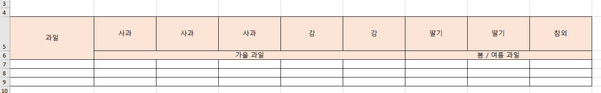
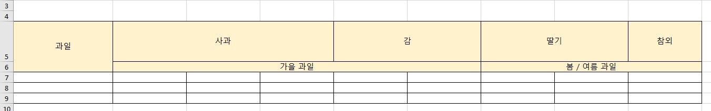

# Excel export 시 같은 column값들(유동적) merge 

DataTable의 data를 excel로 내보낼 때 같은 컬럼의 값들을 merge (=colspan) 시키는 방법이다. <br> 
여기서 눈여겨 볼 점은 `column의 data가 고정적이지 않고 유동적`이다. 

예를 들면 아래의 excel data 중 사과는 사과끼리 merge되고 감은 감끼리 merge되는 형식이다. 
## 기존



## 변경


``` js
customize: function (xlsx) {
    let sheet = xlsx.xl.worksheets['sheet1.xml'];
    let mergeCells = $('mergeCells', sheet);
    let init_data = ['A', 'B', 'C', 'D', 'E', 'F', 'G', 'H', 'I', 'J', 'K', 'L', 'M', 'N', 'O', 'P', 'Q', 'R', 'S', 'T', 'U', 'V', 'W', 'X', 'Y', 'Z'];
    let columnList = ["사과", "사과", "사과", "감", "감", "딸기", "딸기", "참외"];
    let check_element = '';
    let column_num = 0;
    let start_num = 0;

    for (let element of columnList) {
        column_num += 1;

        if (check_element === '') {
            check_element = element;
            start_num = column_num;
        } else if (check_element !== element) {
            mergeCells[0].appendChild(_createNode(sheet, 'mergeCell', {
                attr: {
                    ref: init_data[start_num] + '5:' + init_data[column_num - 1] + '5',
                }
            }));

            start_num = column_num;
            check_element = element;

        } else if (columnList.length === column_num) {
            mergeCells[0].appendChild(_createNode(sheet, 'mergeCell', {
                attr: {
                    ref: init_data[start_num] + '5:' + init_data[column_num] + '5',
                }
            }));
        }
    }
}

function _createNode(doc, nodeName, opts) {
    let tempNode = doc.createElement(nodeName);
    if (opts) {
        if (opts.attr) {
            $(tempNode).attr(opts.attr);
        }
        if (opts.children) {
            $.each(opts.children, function (key, value) {
                tempNode.appendChild(value);
            });
        }
        if (opts.text !== null && opts.text !== undefined) {
            tempNode.appendChild(doc.createTextNode(opts.text));
        }
    }
    return tempNode;
}
```

### 🎈 핵심 흐름
- 처음 시작되는 columnList의 column이름(check_element), index값(start_num) 저장
- for문이 돌면서 check_element와 다른 element가 나오면 **다른 컬럼이름**이 나온 column_num 이전까지 colspan 진행
- colspan이 진행되면 현재 `다른 컬럼이름으로 나온 값을 시작 위치로 지정(start_num)`하고 check_element에다가 현재 column 이름을 저장
